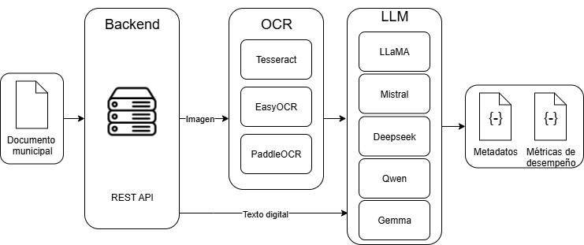
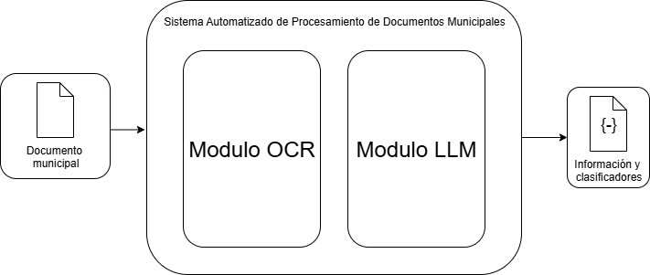
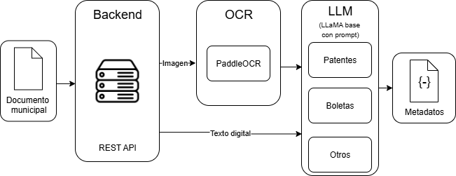

### README.md (raíz del repositorio)

# Proyecto de Título - Extracción y estandarización de información en archivos administrativos mediante OCR y modelos de lenguaje

## Descripción General

Este proyecto corresponde a una tesis de Ingeniería Civil Informática desarrollada para la Municipalidad de Valparaíso. El objetivo fue implementar un **sistema automatizado de gestión documental** basado en **técnicas de inteligencia artificial**.

La solución permite **digitalizar, clasificar y extraer metadatos clave** desde documentos administrativos en PDF, combinando motores **OCR** y **LLMs (Large Language Models)**. El sistema expone resultados mediante una **API REST**, devolviendo **JSON estructurado**, y se alinea con la **Ley 21.180 de Transformación Digital del Estado**.

## Tecnologías Utilizadas

* Framework API: FastAPI + Uvicorn
* OCR: Tesseract, EasyOCR, PaddleOCR
* LLMs: LLaMA 3.2 Municipal (custom), Qwen, Mistral, DeepSeek, Gemma
* Motor local de LLMs: Ollama
* Lenguaje: Python
* Dependencias: pip + virtualenv
* Metodología: Scrum

## Arquitectura y solución

**Vista general de la solución y artefactos finales**



**Diagrama de bajo nivel (flujo técnico)**



**Resumen final (síntesis de resultados)**



## Estructura del Proyecto

```
proyecto_titulo/
├── app/
│   ├── api/               # Endpoints y esquemas de entrada/salida
│   ├── services/          # Implementación de OCRs y LLMs
│   └── utils/             # Métricas y utilidades
├── models/                # Archivos Modelfile para Ollama
├── resultados/
│   └── graficos/          # Resultados experimentales (comparaciones)
├── requirements.txt
├── README.md              # Este archivo
└── .gitignore
```

## Requisitos previos

* Python 3.10+
* Ollama instalado y operativo (para ejecutar LLMs locales)
* GPU recomendada para acelerar LLM/OCR (opcional)

## Instalación

```bash
git clone https://github.com/NOMBRE_USUARIO/NOMBRE_REPO.git
cd NOMBRE_REPO
python -m venv venv
# Linux/Mac
source venv/bin/activate
# Windows
venv\Scripts\activate
pip install -r requirements.txt
```

## Ejecución de la API

```bash
uvicorn app.main:app --reload
```

## Modelo LLaMA Municipal (Ollama)

El repositorio incluye un **Modelfile** personalizado para LLaMA.

```bash
cd models/llama3.2-municipal
ollama create llama3.2-municipal -f Modelfile
ollama run llama3.2-municipal
```

* El `Modelfile` está orientado a **extraer metadatos y clasificadores** desde documentos administrativos en español.
* Puedes **modificar el prompt** y parámetros del `Modelfile` según tus necesidades.

## Resultados generales

Durante la validación se procesaron más de **3000 documentos municipales**, evaluando **15 combinaciones** de OCR + LLM. Conclusiones principales:

* **OCR ganador**: PaddleOCR (mejor balance entre velocidad y precisión).
* **LLMs destacados**: LLaMA 3.2 Municipal (3B) y Qwen 2.5 (3B).
* **Mejores combinaciones**: `paddleocr_llama3` y `paddleocr_qwen`.
* **Extracción**: más de **13 clasificadores por documento** en los mejores modelos.

El detalle completo de las métricas y gráficos está en:

- [Resultados completos de gráficos](./resultados/graficos/README_graficos.md)

## Estado del proyecto

Código base funcional con arquitectura modular para intercambiar motores OCR y LLM. La API expone endpoints y esquemas en `/docs`. La carpeta `resultados/graficos` documenta la evaluación experimental.


