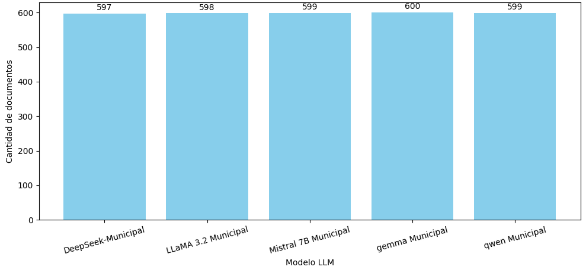
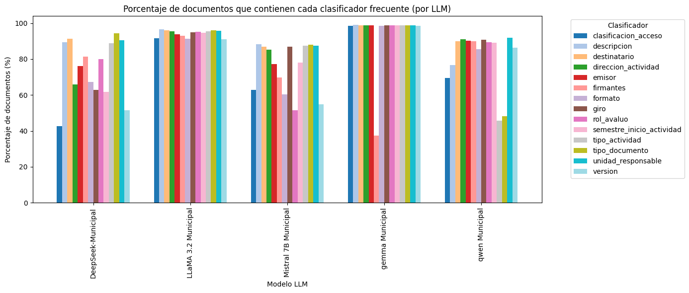
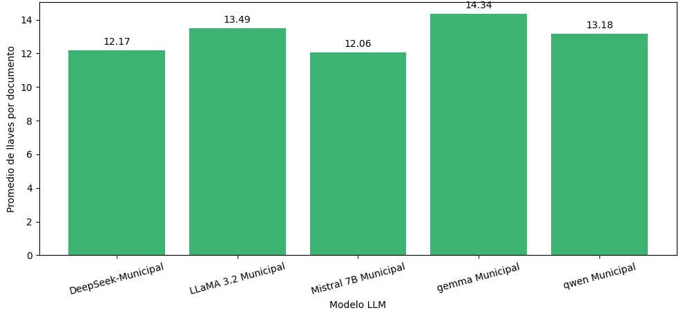
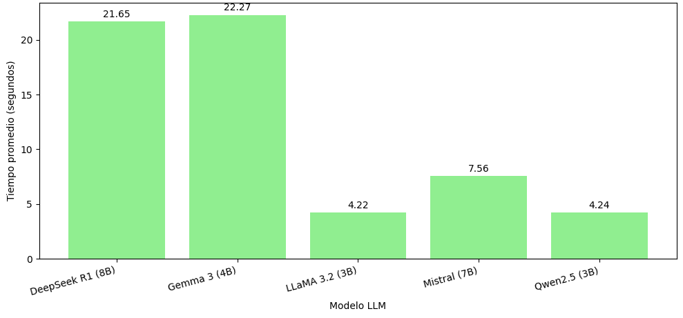
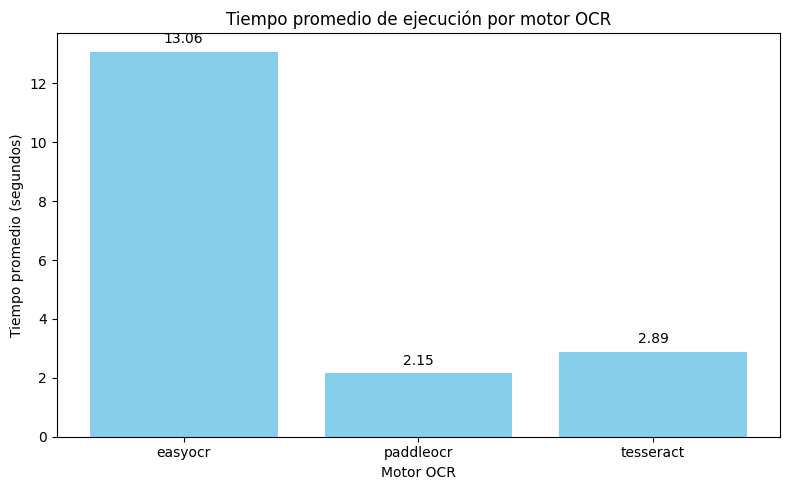
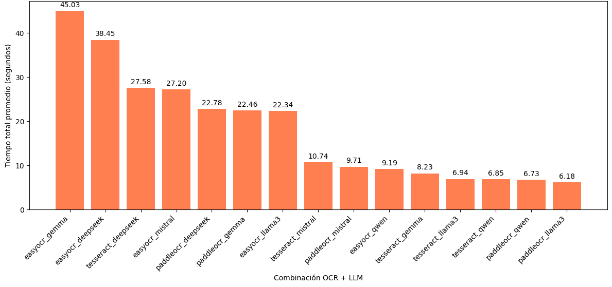
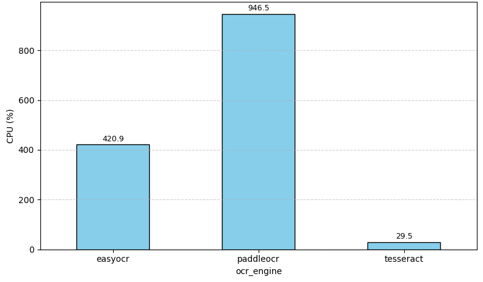
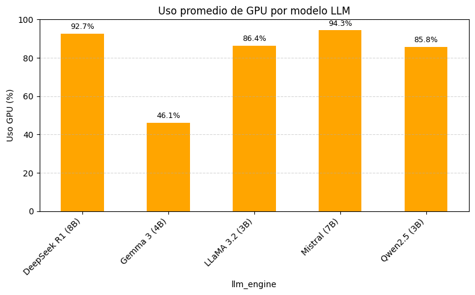
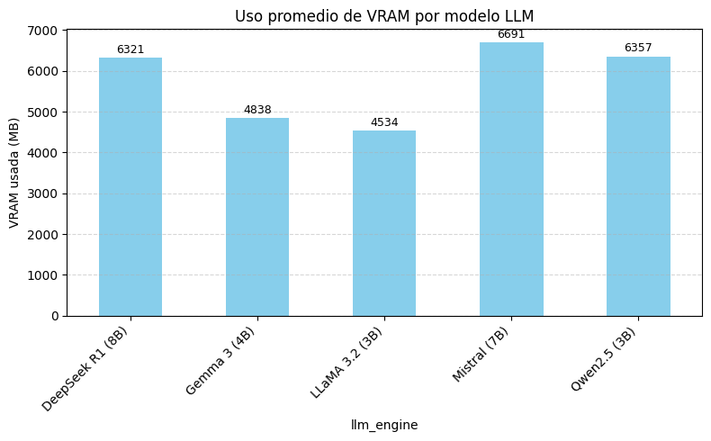

# Resultados Visuales del Proyecto

Este documento contiene los **gráficos comparativos generados durante la fase de evaluación del sistema** para las combinaciones OCR + LLM y rendimiento individual de cada motor.

---

## 1. Cantidad de documentos procesados con éxito por modelo LLM

---

## 2. Porcentaje de documentos que contienen clasificadores frecuentes

---

## 3. Promedio de clasificadores extraídos por documento (por LLM)

---

## 4. Tiempo promedio de ejecución por modelo LLM

---

## 5. Tiempo promedio de ejecución por motor OCR

---

## 6. Tiempo total promedio por combinación OCR + LLM

---

## 7. Uso promedio de CPU por motor OCR

---

## 8. Uso promedio de GPU por modelo LLM

---

## 9. Uso promedio de VRAM por modelo LLM

---

Cada uno de estos gráficos fue generado a partir de un análisis automatizado sobre 9,000 documentos utilizando FastAPI + Ollama, midiendo rendimiento, eficiencia y calidad de extracción de metadatos estructurados.
