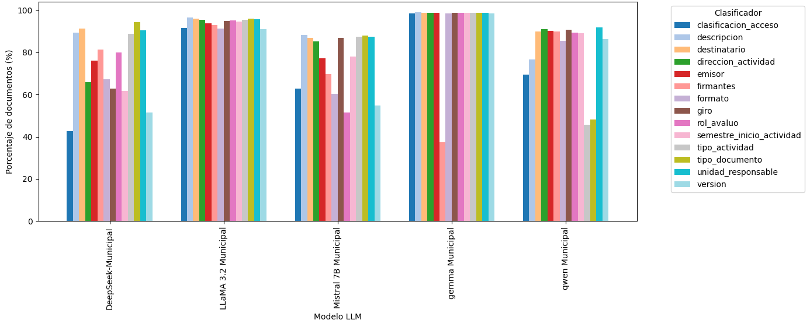
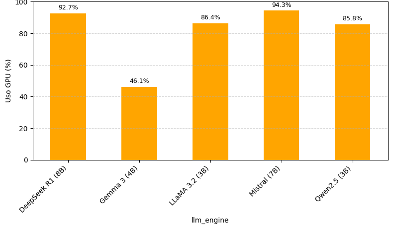

### resultados/graficos/README\_graficos.md

# Resultados Visuales del Proyecto

Este documento reúne los **gráficos de la fase experimental** donde se evaluaron motores **OCR**, **LLMs** y sus combinaciones, sobre más de **3000 documentos municipales**. Se midieron **tiempos de ejecución**, **uso de recursos** y **calidad de extracción** de clasificadores.

## Índice

1. Arquitectura y síntesis de resultados
2. Métricas de calidad (clasificadores, precisión y similitud)
3. Rendimiento y tiempos
4. Consumo de recursos (CPU/GPU/VRAM)
5. Conclusiones

---

## 1. Arquitectura y síntesis de resultados

* Diagrama de solución:
  
* Diagrama de bajo nivel:
  
* Resumen final:
  

---

## 2. Métricas de calidad

**Cobertura y éxito por modelo**

* Documentos procesados con éxito por LLM:
  
* Clasificadores frecuentes (porcentaje de documentos con llaves):
  
* Promedio de clasificadores por documento (por LLM):
  
* Comparación de cantidad de llaves:
  
* Clasificadores por municipalidad y promedios:
  
  

**Calidad de extracción (validación)**

* Precisión exacta:
  
* Similitud exacta y fuzzy:
  
  
* Errores y vacíos detectados:
  

**Interpretación breve**

* LLaMA 3.2 Municipal y Qwen 2.5 entregan mayor estabilidad en la cantidad de clasificadores y precisión.
* La variabilidad por municipalidad sugiere que **prompting específico por tipo de documento** mejora resultados.

---

## 3. Rendimiento y tiempos

* Tiempo promedio de ejecución por LLM:
  
* Tiempo promedio de ejecución por OCR:
  
* Tiempo total promedio por combinación OCR + LLM:
  
* Comparaciones adicionales de tiempo (por PC / global):
  
  
  
  
  

**Interpretación breve**

* PaddleOCR es consistentemente el **más rápido**.
* Las combinaciones con LLaMA 3.2 y Qwen 2.5 logran **mejor tiempo total** sin sacrificar calidad.

---

## 4. Consumo de recursos

* Uso promedio de CPU por OCR:
  
* Uso promedio de GPU por LLM:
  
* Uso promedio de VRAM por LLM:
  
* Comparaciones por equipo (GPU/VRAM):
  
  
  
  
  

**Interpretación breve**

* El **consumo de VRAM** de LLaMA 3.2 y Qwen 2.5 se mantiene dentro de rangos eficientes para GPUs de rango medio.
* PaddleOCR presenta **bajo uso de CPU** en comparación con alternativas.

---

## 5. Conclusiones

* **OCR ganador**: PaddleOCR (velocidad y estabilidad).
* **LLMs recomendados**: LLaMA 3.2 Municipal (3B) y Qwen 2.5 (3B).
* **Mejor balance global**: combinaciones `paddleocr_llama3` y `paddleocr_qwen`.
* El enfoque con **prompts bien diseñados** resulta **más flexible y replicable** que el fine-tuning por departamento, manteniendo eficiencia y trazabilidad.