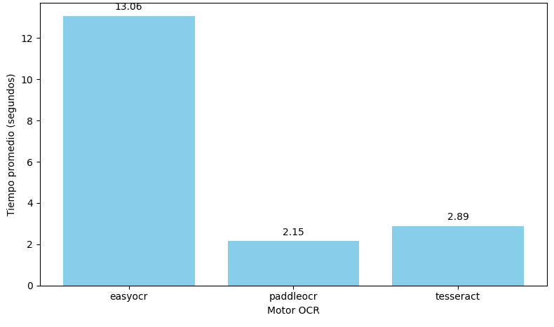
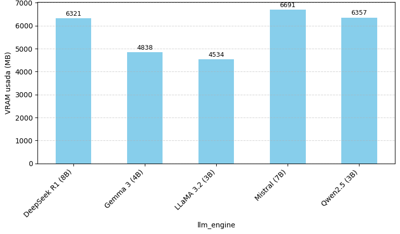
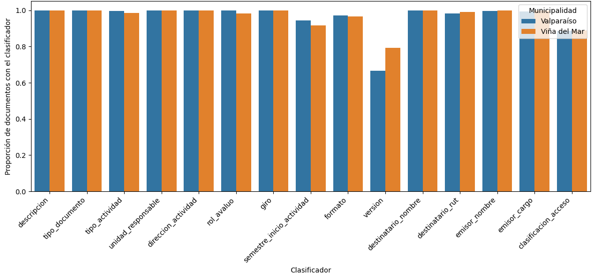

### resultados/graficos/README\_graficos.md

# Resultados, Validación e Implantación

Este documento resume los resultados de la etapa experimental y de validación del sistema automatizado de gestión documental. Se incluyen los hallazgos principales en términos de métricas de desempeño (tiempos, uso de recursos, extracción de clasificadores), así como los análisis de validación en distintos entornos computacionales e institucionales. Finalmente, se presentan observaciones sobre la implantación práctica del sistema.

---

## 1. Resultados del sistema base

### 1.1 Motores OCR

* Tiempo promedio por motor OCR:
  
* Uso promedio de CPU:
  

**Conclusión:** PaddleOCR fue el motor más robusto frente a documentos escaneados con baja calidad, aunque con mayor consumo de CPU.

### 1.2 Modelos LLM

* Tiempo promedio por modelo:
  
* Uso promedio de GPU:
  
* Uso promedio de VRAM:
  
* Promedio de clasificadores por documento:
  
* Porcentaje de documentos con clasificadores frecuentes:
  

**Conclusión:** LLaMA y Qwen mostraron el mejor equilibrio entre eficiencia y precisión. LLaMA destacó por menor consumo de VRAM.

### 1.3 Combinaciones OCR + LLM

* Tiempo total por combinación:
  

**Conclusión:** PaddleOCR con LLaMA o Qwen ofrecieron el mejor balance global.

---

## 2. Comparación modelos base vs fine-tuned

* Uso de GPU:
  
* Uso de VRAM:
  
* Tiempo promedio:
  
* Tiempo total:
  
* Clasificadores promedio:
  

**Conclusión:** El fine-tuning entregó mejoras marginales en estandarización, pero no justificó el costo. Los modelos base con prompts fueron más flexibles y relevantes.

---

## 3. Validación del sistema

### 3.1 Portabilidad técnica

Ejecución en distintos equipos:

* Distribución de tiempos por GPU:
  
* Evolución de tiempos por documento:
  
* Uso GPU por equipo:
  
* Uso VRAM por equipo:
  
* Clasificadores promedio por GPU:
  

**Conclusión:** El sistema fue portable y mantuvo resultados equivalentes en RTX 4060 y A4000, con mejor desempeño en la A4000.

### 3.2 Adaptabilidad institucional

Aplicación en documentos de Viña del Mar:

* Promedio de clasificadores por municipalidad:
  
* Presencia de clasificadores frecuentes:
  

**Conclusión:** El sistema mantuvo rendimiento consistente sin necesidad de ajustes específicos, confirmando su reutilización en distintos municipios.

### 3.3 Validación con datos reales (Las Condes)

* Errores por campo:
  
* Precisión exacta:
  
* Similitud fuzzy:
  

**Conclusión:** Alta precisión en campos estructurados y enriquecimiento con metadatos adicionales, facilitando interoperabilidad.

---

## 4. Implantación del sistema

Durante la etapa de implantación, se definieron los requisitos mínimos y recomendados:

* **Requisitos mínimos:** GPU con 6 GB VRAM, procesador de 4 núcleos, 8 GB RAM.
* **Requisitos recomendados:** GPU de gama media-alta (ej. RTX A4000), procesador de 8 núcleos, 32 GB RAM.

Se ejecutaron pruebas de instalación y despliegue en entornos locales, documentando el proceso y verificando compatibilidad con dependencias (FastAPI, Ollama, OCRs). Los gráficos de desempeño confirmaron que la infraestructura recomendada garantiza tiempos óptimos.

---

## 5. Conclusión general

* **OCR ganador:** PaddleOCR.
* **LLM preferido:** LLaMA 3.2 Municipal, con Qwen como alternativa.
* **Mejor combinación:** PaddleOCR + LLaMA.
* **Validación:** El sistema fue portable, adaptable y preciso en distintos contextos municipales.
* **Implantación:** Requisitos técnicos claros y comprobación en entornos reales.

En conjunto, el sistema se valida como una solución **replicable, escalable y de bajo costo**, adecuada para apoyar la modernización documental en municipios chilenos.
